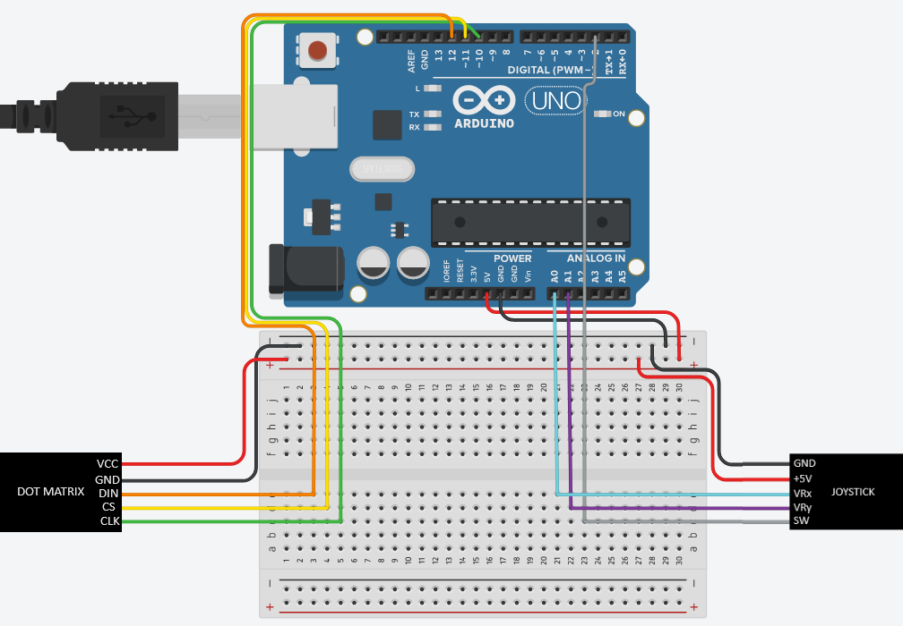

# Arduino-Dot-Matrix-Maze
A basic but complete Arduino maze game controlled via 2-axis Joystick!

## Components: 
* Arduino board (any should do)
* Breadboard (not strictly required) 
* MAX7219 DotMatrix Module
* 2 Axis Joystick
* Minimum of 10 F-M Cables

### Wiring Guide for Breadboard:

Note that the breadboard isn't required as long as you have an alternate way to provide a 5v supply to both both the joystick and dot matrix.
